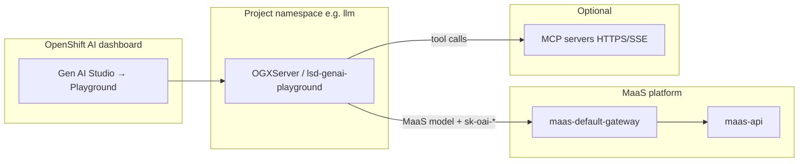

# Gen AI Studio: Playground, OGX, and MCP Servers

RHOAI **3.5+** adds **Gen AI Studio** — an interactive layer on top of MaaS for chat, RAG, tool calling, and MCP integration. This page covers enabling the **Playground** (powered by **OGX**), wiring **MaaS models**, and registering **Model Context Protocol (MCP)** servers.

> **Tip:** MaaS (Phases 1–8) and Gen AI Studio are complementary. MaaS governs production API access (`sk-oai-*` keys, subscriptions, rate limits). OGX/Playground is for **experimentation** in the dashboard — it calls MaaS (or in-cluster endpoints) as a client.

> **Important:** Companion to the [official RHOAI 3.5 Gen AI playground docs](https://docs.redhat.com/en/documentation/red_hat_openshift_ai_self-managed/3.5/html/experimenting_with_models_in_the_gen_ai_playground/index). Technology Preview features (multimodal input, parts of AI asset endpoints) may change.

## Architecture



| Component | Namespace | Role |
|-----------|-----------|------|
| **OGX operator** | `opendatahub-ogx-system` | Deploys `OGXServer` CRs (replaces Llama Stack in 3.5) |
| **Playground pod** | Your project (`llm`, …) | `lsd-genai-playground` — chat UI backend |
| **MCP catalog** | `redhat-ods-applications` | ConfigMap `gen-ai-aa-mcp-servers` |
| **MaaS gateway** | `openshift-ingress` | Governed inference for published models |

See also: [MaaS Namespaces Reference](./maas-namespaces.md).

## Prerequisites

| Requirement | Check |
|-------------|-------|
| RHOAI **3.5+** | `oc get csv -n redhat-ods-operator \| grep rhods-operator` |
| MaaS platform ready | `curl -sk https://maas.<domain>/maas-api/health` → `{"status":"healthy"}` |
| **`genAiStudio: true`** | `oc get odhdashboardconfig odh-dashboard-config -n redhat-ods-applications -o jsonpath='{.spec.dashboardConfig.genAiStudio}{"\n"}'` |
| **`ogx: Managed`** | See [Enable OGX](#enable-ogx-rhoai-35) below |
| Project namespace labeled | `oc label namespace llm opendatahub.io/dashboard=true --overwrite` |
| User in `rhods-users` | OpenShift group or SSO group mapping |
| Model published to MaaS | `MaaSModelRef` **Ready** + subscription + auth policy ([Phase 5](./05-maas-models.md#maas-governance-native-ui)) |

## Enable OGX (RHOAI 3.5)

The Playground submenu (**Gen AI Studio → Playground**) appears only when **OGX** is enabled. On many MaaS-only installs, `ogx` defaults to **`Removed`** while legacy `llamastackoperator` may still be `Managed` — enable OGX explicitly:

```bash
oc patch datasciencecluster default-dsc --type=merge -p '{
  "spec": {
    "components": {
      "ogx": { "managementState": "Managed" },
      "llamastackoperator": { "managementState": "Removed" }
    }
  }
}'

# Wait for CRD (1–3 min)
oc get crd ogxservers.ogx.io

# Confirm dashboard flags
oc patch odhdashboardconfig odh-dashboard-config -n redhat-ods-applications --type=merge -p '{
  "spec": { "dashboardConfig": { "genAiStudio": true, "modelAsService": true } }
}'

# Hard-refresh the dashboard or restart it if the menu does not update
oc rollout restart deployment/rhods-dashboard -n redhat-ods-applications
```

Verify:

```bash
oc get datasciencecluster default-dsc -o jsonpath='ogx={.spec.components.ogx.managementState}{"\n"}'
oc get csv -n opendatahub-ogx-system 2>/dev/null | head -5
```

> **Note:** `setup-maas.sh` sets `genAiStudio` and `modelAsService` but does **not** enable OGX by default. Add the patch above after Phase 4 on RHOAI 3.5 clusters that need Playground.

## Create a playground instance

The Playground tab is empty until you create an instance per project.

1. **Gen AI Studio → Playground**
2. Project drop-down → select **`llm`** (or your model namespace)
3. **Create playground**
4. Select models (e.g. Gemma MaaS entry) → **Create**
5. Wait for the OGX server pod:

```bash
oc get ogxserver -n llm
oc get pods -n llm | grep genai-playground
```

### Using MaaS models in Playground

| Setting | Value |
|---------|-------|
| Base URL | `https://maas.<cluster-domain>/v1` (gateway root) |
| Model id | `publishers/<namespace>/models/<name>` from `MaaSModelRef.status.resolvedModelAlias` |
| Auth | Mint `sk-oai-*` under **Gen AI Studio → API keys** (subscription must match the model) |

Do **not** use the short KServe name (e.g. `gemma-4-e4b-it`) as the model id for MaaS — Playground may 404. See [duplicate endpoints troubleshooting](./05-maas-models.md#duplicate-entries-in-ai-asset-endpoints--playground).

Example:

```bash
oc get maasmodelref gemma-4-e4b-it -n llm -o jsonpath='{.status.resolvedModelAlias}{"\n"}'
# publishers/llm/models/gemma-4-e4b-it
```

## MCP servers {#mcp-servers}

MCP (Model Context Protocol) lets the Playground call external **tools** (web fetch, GitHub, custom APIs). Registration is **cluster-admin** work; authorization is **per user session** in the Playground UI.

### Admin: register MCP servers (ConfigMap)

Create **`gen-ai-aa-mcp-servers`** in **`redhat-ods-applications`**. Each key is a display name; each value is JSON with `url` and `description`.

Example manifest (also in `manifests/13-gen-ai-studio/gen-ai-aa-mcp-servers.yaml`):

```bash
oc apply -f manifests/13-gen-ai-studio/gen-ai-aa-mcp-servers.yaml
```

Or apply inline:

```yaml
apiVersion: v1
kind: ConfigMap
metadata:
  name: gen-ai-aa-mcp-servers
  namespace: redhat-ods-applications
data:
  Fetch: |
    {
      "url": "https://remote.mcpservers.org/fetch",
      "description": "Fetch web pages and convert HTML to markdown."
    }
  GitHub-MCP-Server: |
    {
      "url": "https://api.githubcopilot.com/mcp/x/repos/readonly",
      "description": "Read-only GitHub repo access. Token required at authorize time."
    }
```

Rules:

- ConfigMap **name** must be exactly `gen-ai-aa-mcp-servers`
- ConfigMap **namespace** must be `redhat-ods-applications`
- Each **key** is case-sensitive and must be unique (this is the name shown in the UI)
- Each **value** must be valid JSON with at least `"url"` and `"description"`
- Add or edit keys and re-`oc apply` to update the catalog (no dashboard restart required in most cases)

Verify:

```bash
oc get configmap gen-ai-aa-mcp-servers -n redhat-ods-applications
```

Registered servers also appear under **Gen AI Studio → AI asset endpoints → MCP Server** (read-only list).

### Self-hosted MCP on the cluster

Point the ConfigMap at a Route or Service URL reachable **from the playground pod** in your project namespace:

```json
{
  "url": "https://my-mcp.apps.<cluster-domain>/sse",
  "description": "Internal MCP server (SSE transport)."
}
```

Egress from the OGX pod must reach the URL. Test from the playground namespace if connections fail.

### User: connect MCP in Playground

Prerequisites:

- Playground instance created for your project
- Model with **tool-calling** enabled (see below)
- Admin has applied `gen-ai-aa-mcp-servers`

Procedure:

1. Open **Gen AI Studio → Playground** → your instance
2. Settings panel → **MCP** tab
3. Enable the checkbox for each server
4. Click **Auth** → enter access token if required → **Authorize**
5. Click **View tools** (wrench) to list available tools
6. Prompt the model to use a tool by name

> **Note:** MCP authorization tokens are stored in the **browser session only**. Re-authorize after closing the browser.

Official procedure: [Testing with MCP servers (RHOAI 3.5)](https://docs.redhat.com/en/documentation/red_hat_openshift_ai_self-managed/3.5/html/experimenting_with_models_in_the_gen_ai_playground/testing-with-model-context-protocol-servers_rhoai-user).

### Model requirements for MCP / tool calling

The conversation model must support **tool calling**. Configure the vLLM serving runtime with arguments such as:

```
--enable-auto-tool-choice
--tool-call-parser=<parser-for-model-family>
```

Parser names vary by model (e.g. `hermes`, `llama3_json`, `qwen3`). Check the model card and [vLLM tool calling docs](https://docs.vllm.ai/en/latest/features/tool_calling.html).

Without tool calling, the model may ignore MCP tools or emit raw `<tool_call>` XML instead of invoking them.

## Dashboard navigation (RHOAI 3.5)

| Menu | Purpose |
|------|---------|
| **Gen AI Studio → Playground** | Create OGX playground instances; chat, RAG, MCP |
| **Gen AI Studio → AI asset endpoints** | Models + MCP Server catalog for the selected project |
| **Gen AI Studio → API keys** | End-user MaaS key minting (separate from Playground) |
| **Settings → MaaS governance** | Admin: subscriptions + auth policies |

## Troubleshooting

| Symptom | Likely cause | Fix |
|---------|--------------|-----|
| No **Playground** submenu | OGX not enabled | [Enable OGX](#enable-ogx-rhoai-35) |
| Playground tab empty | No instance created | **Create playground** for your project |
| Project missing in drop-down | Namespace not a dashboard project | `oc label namespace llm opendatahub.io/dashboard=true` |
| MCP tab empty | ConfigMap missing | Apply `gen-ai-aa-mcp-servers` |
| MCP Auth fails | Bad token or URL unreachable from OGX pod | Check token; test URL from `llm` namespace |
| Chat 404 on MaaS model | Wrong model id or missing API key | Use `publishers/…/models/…`; mint key for correct subscription |
| Model ignores tools | Tool calling not enabled on runtime | Add vLLM `--enable-auto-tool-choice` + parser |
| `demo` user cannot see models | Not in `rhods-users` | SSO group mapping or `oc adm groups add-users rhods-users demo` |

## Related pages

- [Phase 4 — RHOAI Configuration](./04-rhoai-config.md) — dashboard flags, MaaS enablement
- [Phase 5 — Model Deployment](./05-maas-models.md) — Publish as MaaS, governance, playground model ids
- [MaaS Namespaces Reference](./maas-namespaces.md) — where OGX, MaaS, and model CRs live
- [Architecture & Request Flow](./08-architecture.md) — MaaS inference path (separate from OGX)

## References

- [RHOAI 3.5 — Experimenting with models in the gen AI playground](https://docs.redhat.com/en/documentation/red_hat_openshift_ai_self-managed/3.5/html/experimenting_with_models_in_the_gen_ai_playground/index)
- [Playground prerequisites (MCP ConfigMap)](https://docs.redhat.com/en/documentation/red_hat_openshift_ai_self-managed/3.5/html/experimenting_with_models_in_the_gen_ai_playground/playground-prerequisites_rhoai-user)
- [Llama Stack to OGX migration (RHOAI 3.5)](https://docs.redhat.com/en/documentation/red_hat_openshift_ai_self-managed/3.5/html/working_with_ogx/llama-stack-to-ogx-migration_rag)
