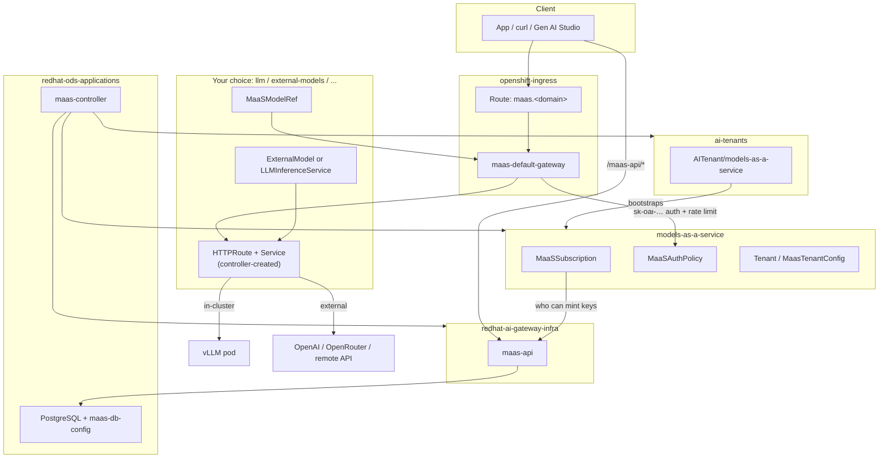

# MaaS Namespaces Reference

This page maps every namespace involved in Red Hat OpenShift AI Models as a Service (MaaS): which ones RHOAI creates, which ones you create, what runs in each, and how they connect during inference and API-key minting.

> **Tip:** All `oc` commands below assume you are logged in with a cluster-admin or sufficient read access.

> **Important:** Companion to the [official RHOAI MaaS docs](https://docs.redhat.com/en/documentation/red_hat_openshift_ai_self-managed/3.5/html/govern_llm_access_with_models-as-a-service/index), not a replacement. Namespace layout changed slightly between RHOAI 3.4 and 3.5 — both are noted below.

## Quick mental model

| Question | Namespace |
|----------|-----------|
| Where is the RHOAI operator? | `redhat-ods-operator` |
| Where is PostgreSQL / `maas-controller`? | `redhat-ods-applications` |
| Where is `maas-api`? (RHOAI 3.5+) | `redhat-ai-gateway-infra` |
| Where is tenant bootstrap? | `ai-tenants` |
| Where are subscriptions & auth policies? | `models-as-a-service` |
| Where is the public MaaS gateway? | `openshift-ingress` |
| Where are my models? | **`llm`**, **`external-models`**, or any namespace you label |

**Rule of thumb:** RHOAI owns the **platform** namespaces. You own the **model** namespaces and link them to the gateway with a label + `MaaSModelRef` + governance CRs in `models-as-a-service`.

## Namespace map (layers)



## Layer 1 — Operator & core RHOAI

These namespaces exist as soon as OpenShift AI is installed. They are not MaaS-specific until you enable `modelsAsService: Managed` on the `DataScienceCluster`.

| Namespace | Created by | Role in MaaS |
|-----------|------------|--------------|
| **`redhat-ods-operator`** | OpenShift AI install | Runs the RHOAI operator; reconciles `DataScienceCluster`, `DSCInitialization`, and enables MaaS components |
| **`redhat-ods-applications`** | RHOAI operator | Core application stack: **`maas-controller`**, dashboard, and (from [Phase 3](./03-maas-platform.md)) **PostgreSQL** + **`maas-db-config`** for API-key storage |

**Connection:** Setting `modelsAsService: Managed` in Phase 4 causes the operator to deploy `maas-controller`, which bootstraps the remaining MaaS platform namespaces and CRs.

```bash
oc get csv -n redhat-ods-operator | grep rhods-operator
oc get pods -n redhat-ods-applications | grep -E 'maas|postgres'
```

## Layer 2 — MaaS platform infrastructure (RHOAI-managed)

| Namespace | Created by | What lives there |
|-----------|------------|------------------|
| **`redhat-ai-gateway-infra`** | `maas-controller` (RHOAI **3.5+**) | **`maas-api`** deployment — mint, validate, and revoke `sk-oai-*` API keys |
| **`ai-tenants`** | `maas-controller` (RHOAI **3.5+**) | **`AITenant`** CRs — infrastructure for tenant bootstrap (not where models go) |

On **RHOAI 3.4**, `maas-api` ran in **`redhat-ods-applications`** instead of `redhat-ai-gateway-infra`. The public health URL is unchanged on both versions:

```bash
CLUSTER_DOMAIN=$(oc get ingresses.config/cluster -o jsonpath='{.spec.domain}')
curl -sk "https://maas.${CLUSTER_DOMAIN}/maas-api/health"
# Expected: {"status":"healthy"}
```

| RHOAI | `maas-api` deployment namespace | PostgreSQL / `maas-db-config` |
|-------|-----------------------------------|-------------------------------|
| 3.4 | `redhat-ods-applications` | `redhat-ods-applications` |
| 3.5+ | `redhat-ai-gateway-infra` | `redhat-ods-applications` (unchanged) |

**Connection:**

- `AITenant/models-as-a-service` in **`ai-tenants`** bootstraps the default tenant in **`models-as-a-service`**
- `maas-api` in **`redhat-ai-gateway-infra`** reads/writes key metadata in PostgreSQL via `maas-db-config`
- `maas-api` is exposed externally at `https://maas.<domain>/maas-api/...` through the gateway in **`openshift-ingress`**

```bash
oc get aitenant -n ai-tenants
oc get deployment maas-api -n redhat-ai-gateway-infra
# RHOAI 3.4 fallback:
oc get deployment maas-api -n redhat-ods-applications
```

> **Note:** Do not place `ExternalModel` or `LLMInferenceService` CRs in `redhat-ai-gateway-infra` or `ai-tenants`. They are platform plumbing, not model workloads.

## Layer 3 — Default tenant & governance (RHOAI-managed)

| Namespace | Created by | What lives there |
|-----------|------------|------------------|
| **`models-as-a-service`** | `maas-controller` | **`MaaSAuthPolicy`**, **`MaaSSubscription`**, **`Tenant`** / **`MaasTenantConfig`** — who may call models and mint keys |

This is the **policy and subscription layer**. It does not run inference pods or store `ExternalModel` backends.

| CR | Purpose |
|----|---------|
| `MaaSSubscription` | Which users/groups may mint keys; token rate limits (Limitador) |
| `MaaSAuthPolicy` | Which API keys may call which models (Authorino) |
| `Tenant` / `MaasTenantConfig` | Tenant-level platform config (OIDC, telemetry, API-key settings) |

**Connection:**

- `import-external-models.sh` creates `MaaSAuthPolicy` + `MaaSSubscription` here by default (`--governance-namespace models-as-a-service`)
- The gateway in **`openshift-ingress`** reads these CRs on every inference request
- `maas-api` checks subscription bindings when minting or validating keys

```bash
oc get maasauthpolicy,maassubscription,tenant -n models-as-a-service
```

### Multi-tenant (RHOAI 3.5+)

Additional tenants are provisioned by creating more **`AITenant`** objects in **`ai-tenants`**. The controller then creates dedicated namespaces such as `ai-tenant-<name>` with their own `MaasTenantConfig`, `maas-api` instance, and gateway policies. The default tenant keeps the legacy name **`models-as-a-service`** for migration compatibility.

See the [upstream multi-tenant setup guide](https://github.com/opendatahub-io/models-as-a-service/blob/main/docs/content/install/multi-tenant-setup.md) for details beyond single-tenant installs.

## Layer 4 — Gateway edge (OpenShift + RHOAI)

| Namespace | Created by | What lives there |
|-----------|------------|------------------|
| **`openshift-ingress`** | OpenShift / RHOAI | **`maas-default-gateway`** (Gateway API + Istio), TLS secrets, EnvoyFilters, gateway proxy pods |

This is the **front door** for all MaaS traffic:

- Inference: `https://maas.<cluster-domain>/<namespace>/<model>/v1/...`
- Catalog: `https://maas.<cluster-domain>/v1/models`
- API keys: `https://maas.<cluster-domain>/maas-api/v1/api-keys`

**Connection:**

- HTTPRoutes in model namespaces attach to `maas-default-gateway`
- Only namespaces labeled **`maas.opendatahub.io/gateway-access=true`** may attach routes ([Phase 2](./02-platform-config.md))
- Kuadrant / Authorino / Limitador enforce `MaaSAuthPolicy` and `MaaSSubscription` at this layer

```bash
oc get gateway maas-default-gateway -n openshift-ingress
oc get route maas-default-gateway-https -n openshift-ingress
```

## Layer 5 — Model namespaces (you create)

RHOAI does **not** mandate a single models namespace. You (or this guide) choose where catalog entries and backends live.

| Namespace | Typical use | What you put there |
|-----------|-------------|-------------------|
| **`llm`** | In-cluster models; Compact MaaS convention | `LLMInferenceService`, `MaaSModelRef`, sometimes `ExternalModel` |
| **`external-models`** | Default in this guide for SaaS APIs | `ExternalModel` + `MaaSModelRef` (created by `import-external-models.sh`) |
| **Any project namespace** | GUI-deployed models (e.g. Gemma) | `LLMInferenceService` + published `MaaSModelRef` |

### What goes where (split by concern)

| Concern | Namespace | Example CRs |
|---------|-----------|-------------|
| Model backend | Model namespace (`llm`, `external-models`, …) | `LLMInferenceService`, `ExternalModel` |
| Catalog entry | Same model namespace | `MaaSModelRef` |
| Networking (auto-created) | Same model namespace | `HTTPRoute`, `Service`, `ServiceEntry` (from controller reconcile) |
| Governance | `models-as-a-service` | `MaaSAuthPolicy`, `MaaSSubscription` |
| Provider API key (external only) | Model namespace | `Secret` with `bbr-managed`, `ipp-managed`, and `inference.llm-d.ai/ipp-managed` labels |

**Connection:**

1. Label the model namespace: `maas.opendatahub.io/gateway-access=true`
2. Apply **`MaaSModelRef`** (and **`ExternalModel`** for SaaS backends) in that namespace
3. Apply governance CRs in **`models-as-a-service`** (or use `import-external-models.sh` which does both)
4. Gateway path becomes: `https://maas.<domain>/<namespace>/<model-name>/v1/chat/completions`

```bash
# Label (required for gateway route attachment)
oc label namespace external-models maas.opendatahub.io/gateway-access=true --overwrite

# Models vs governance live in different namespaces
oc get maasmodelref,externalmodel -n external-models
oc get maasauthpolicy,maassubscription -n models-as-a-service
```

See [Phase 8 — External Models](./08-external-models.md) for the external-model request path and [Phase 5 — Model Deployment](./05-maas-models.md) for in-cluster publishing.

## Layer 6 — Optional add-ons (this guide only)

These are **not** part of native RHOAI MaaS. They are deployed by optional phases in this repository.

| Namespace | When | Role |
|-----------|------|------|
| **`compact-maas`** | `--with-compact-maas` | Compact MaaS Admin GUI / BFF |
| LiteMaaS stack | `--with-litemaas` | LiteLLM proxy and spend UI |
| Lago / OpenMeter | Phases 11–12 | Usage metering and budget enforcement |

They sit on top of native MaaS and read the same `MaaSModelRef` catalog; they do not replace platform namespaces.

## Request flows across namespaces

### Inference request

```
Client
  → openshift-ingress (maas-default-gateway)
  → Authorino checks MaaSAuthPolicy in models-as-a-service (API key valid?)
  → Limitador checks MaaSSubscription token limits
  → HTTPRoute in llm or external-models
  → in-cluster vLLM pod  OR  external HTTPS API (BBR injects provider key)
```

For external models, BBR (Bridge-Based Routing) replaces the client's `sk-oai-*` key with the upstream provider key stored in a labeled `Secret` in the model namespace. No inference pod runs on-cluster.

### Mint API key

```
Client (OpenShift / SSO token)
  → openshift-ingress → /maas-api/v1/api-keys
  → maas-api in redhat-ai-gateway-infra
  → PostgreSQL in redhat-ods-applications
  → subscription must exist in models-as-a-service
```

Gen AI Studio **API keys** and `curl` against `/maas-api` both follow this path.

## Full namespace checklist

Use this table when auditing a cluster or debugging "where does this CR live?"

| Namespace | Who creates it | You deploy models here? | Key resources |
|-----------|----------------|-------------------------|---------------|
| `redhat-ods-operator` | RHOAI install | No | Operator, CSV, subscriptions |
| `redhat-ods-applications` | RHOAI operator | No | `maas-controller`, PostgreSQL, `maas-db-config`, dashboard |
| `redhat-ai-gateway-infra` | `maas-controller` (3.5+) | No | `maas-api` |
| `ai-tenants` | `maas-controller` (3.5+) | No | `AITenant` CRs |
| `models-as-a-service` | `maas-controller` | No | `MaaSAuthPolicy`, `MaaSSubscription`, `Tenant` |
| `openshift-ingress` | OpenShift / RHOAI | No | `maas-default-gateway`, routes, EnvoyFilters |
| `llm` | You / GUI / guide | **Yes** | `LLMInferenceService`, `MaaSModelRef` |
| `external-models` | You / import script | **Yes** | `ExternalModel`, `MaaSModelRef` |

## Troubleshooting by namespace

| Symptom | Check |
|---------|-------|
| `maas-api/health` fails | `oc get pods -n redhat-ai-gateway-infra`; Postgres in `redhat-ods-applications` |
| Model not in gateway catalog | `MaaSModelRef` phase in model namespace; governance CRs in `models-as-a-service` |
| Inference `401` / `403` | `MaaSAuthPolicy` + `MaaSSubscription` in `models-as-a-service`; key subscription name |
| Inference `404` | HTTPRoute in model namespace; `gateway-access` label on namespace |
| External model empty upstream `401` | Provider `Secret` labels (`bbr-managed`, `ipp-managed`, `inference.llm-d.ai/ipp-managed`) in model namespace; restart `payload-processing` after Secret create/rotate |
| External model `credentials not found in store` | Missing `inference.llm-d.ai/ipp-managed=true` on provider Secret and/or stale BBR cache — see [Phase 8 Known Issues](./08-external-models.md#credentials-not-found-in-store) |
| API key mint `500` / missing username | `maas-api` logs in `redhat-ai-gateway-infra`; gateway EnvoyFilters on `/maas-api` ([Phase 9–10 troubleshooting](./09-optional-guis.md)) |

## One-shot discovery commands

```bash
echo "=== Platform ==="
oc get pods -n redhat-ods-applications -l 'app in (maas-controller,postgres)' 2>/dev/null
oc get pods -n redhat-ai-gateway-infra 2>/dev/null
oc get aitenant -n ai-tenants 2>/dev/null

echo "=== Gateway ==="
oc get gateway maas-default-gateway -n openshift-ingress

echo "=== Governance ==="
oc get maasauthpolicy,maassubscription,tenant -n models-as-a-service

echo "=== Models (all namespaces) ==="
oc get maasmodelref -A
oc get externalmodel -A
oc get llminferenceservice -A
```

## Related pages

- [Architecture & Request Flow](./08-architecture.md) — component layers and step-by-step inference flow
- [Phase 2 — Platform Configuration](./02-platform-config.md) — `gateway-access` label and gateway memory
- [Phase 3 — MaaS Platform](./03-maas-platform.md) — PostgreSQL in `redhat-ods-applications`
- [Phase 4 — RHOAI Configuration](./04-rhoai-config.md) — enabling MaaS and `maas-api` namespace differences
- [Phase 8 — External Models](./08-external-models.md) — `external-models` namespace and `ExternalModel` wiring

## References

- [RHOAI 3.5 MaaS Official Docs](https://docs.redhat.com/en/documentation/red_hat_openshift_ai_self-managed/3.5/html/govern_llm_access_with_models-as-a-service/index)
- [Upstream MaaS controller architecture](https://opendatahub-io.github.io/models-as-a-service/latest/concepts/architecture/)
- [Upstream multi-tenant setup](https://github.com/opendatahub-io/models-as-a-service/blob/main/docs/content/install/multi-tenant-setup.md)
- [AITenant CR reference](https://github.com/opendatahub-io/models-as-a-service/blob/main/docs/content/reference/crds/ai-tenant.md)
